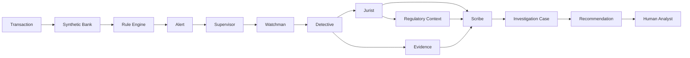
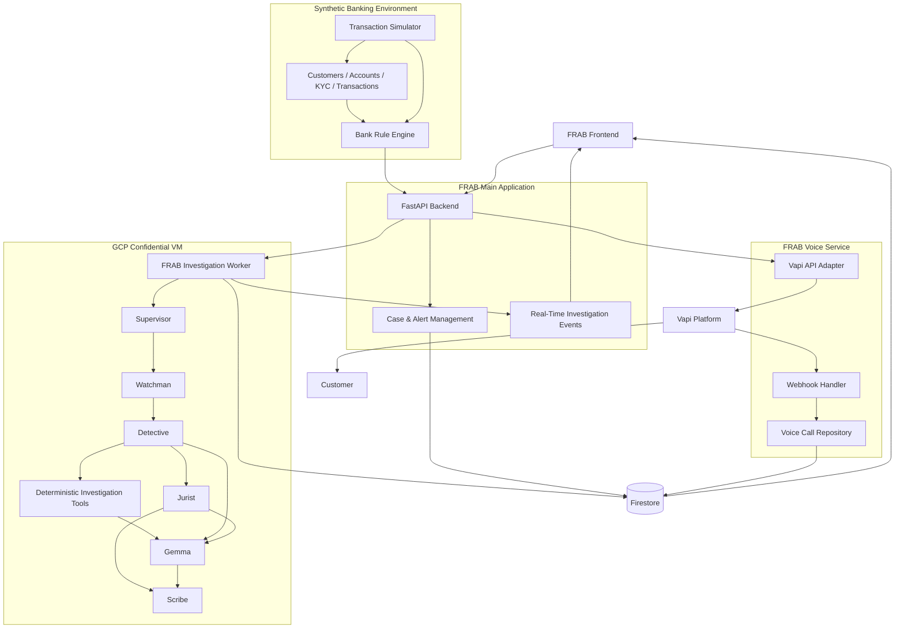
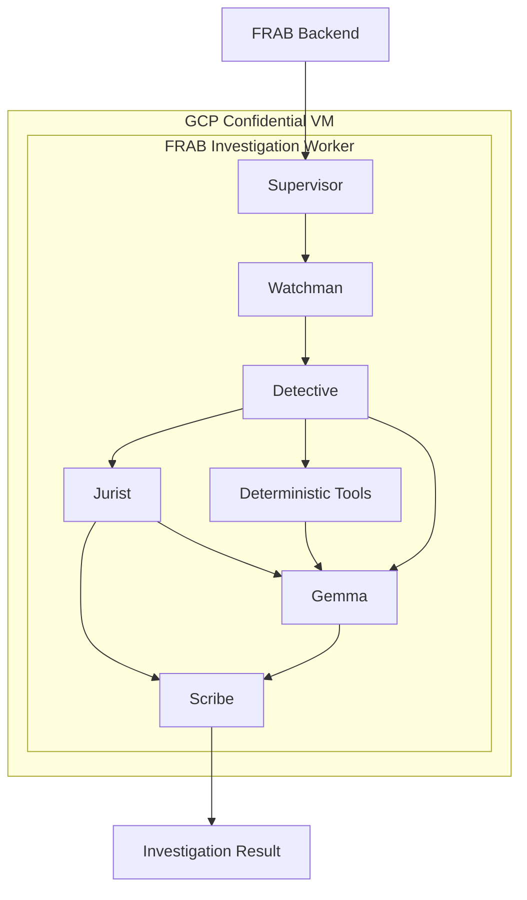
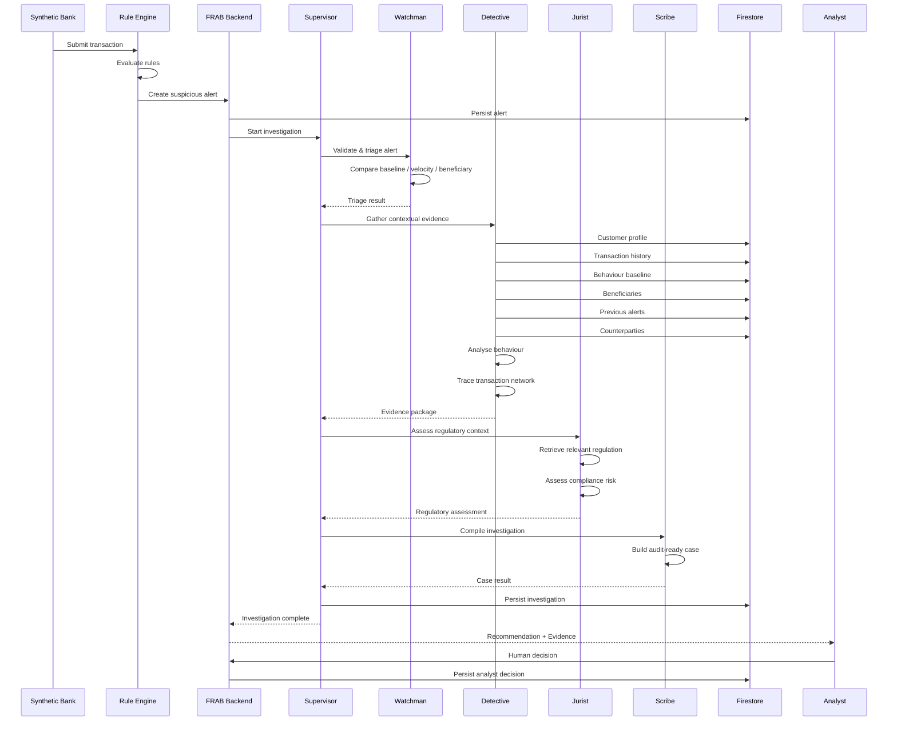
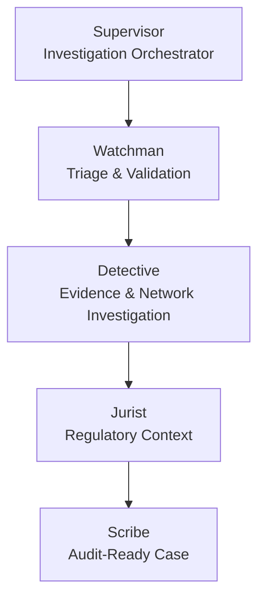
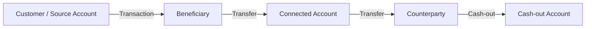
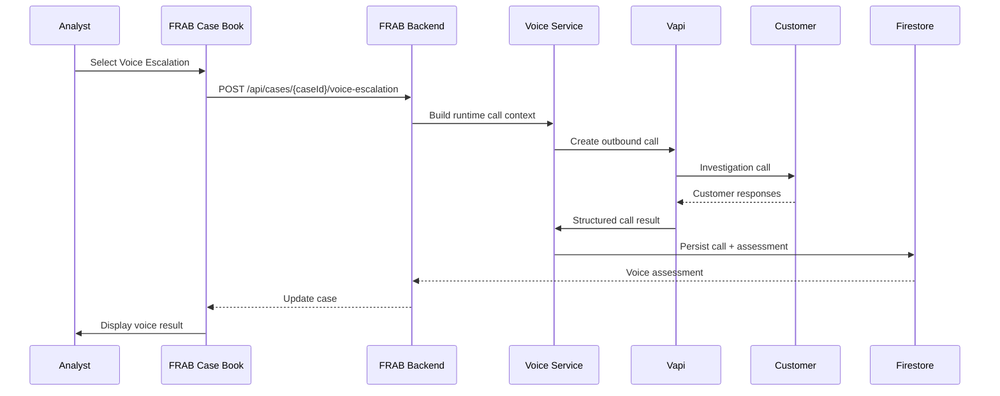
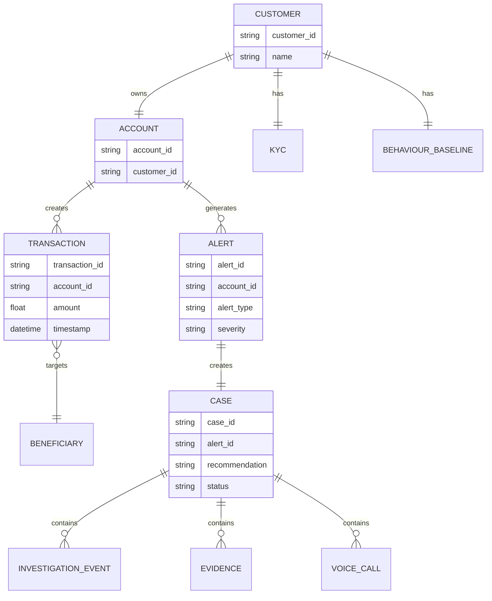
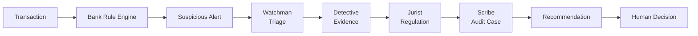

# FRAB — Financial Risk Analysis & Behavioral Investigation

> **The bank detects the signal. FRAB investigates the story behind it.**

> 🏆 **Smart Horizon 2026 — SH-FIN-01**
> **Autonomous Financial Crime Investigation Agent**

FRAB is an autonomous, multi-agent financial crime investigation system that transforms suspicious banking alerts into **contextual, evidence-backed and audit-ready investigations**.

Instead of replacing an existing fraud or AML detection engine, FRAB operates as an **investigation layer after an alert is generated**.

It gathers customer and transaction context, analyses behavioural patterns, traces financial relationships, retrieves regulatory context, reasons over collected evidence and produces a structured recommendation for a human analyst.

---

## Table of Contents

- [Problem](#problem)
- [Solution](#solution)
- [Why FRAB](#why-frab)
- [Key Capabilities](#key-capabilities)
- [End-to-End Workflow](#end-to-end-workflow)
- [System Architecture](#system-architecture)
- [Sequential Investigation Flow](#sequential-investigation-flow)
- [Multi-Agent Architecture](#multi-agent-architecture)
- [Agent Responsibilities](#agent-responsibilities)
- [Deterministic Analysis + Gemma](#deterministic-analysis--gemma)
- [Confidential AI Execution](#confidential-ai-execution)
- [Synthetic Banking Environment](#synthetic-banking-environment)
- [Fraud Investigation Scenarios](#fraud-investigation-scenarios)
- [Crime DNA Fingerprint](#crime-dna-fingerprint)
- [Financial Network Investigation](#financial-network-investigation)
- [Investigation Output](#investigation-output)
- [Voice Investigation Escalation](#voice-investigation-escalation)
- [Technology Stack](#technology-stack)
- [Data Model](#data-model)
- [Security & Privacy](#security--privacy)
- [Results](#results)
- [Novelty](#novelty)
- [Implementation](#implementation)
- [Running the Project](#running-the-project)
- [Environment Variables](#environment-variables)
- [Project Structure](#project-structure)
- [Demo Flow](#demo-flow)
- [Evaluation & Validation](#evaluation--validation)
- [Limitations](#limitations)
- [Future Enhancements](#future-enhancements)
- [Research & References](#research--references)
- [Hackathon Context](#hackathon-context)
- [License](#license)

---

# Problem

Financial institutions generate large volumes of fraud and AML alerts every day.

The challenge is that:

> **An alert is not an investigation.**

A conventional detection system may identify that a transaction is suspicious because of:

- unusually high transaction value
- new beneficiary
- abnormal transaction velocity
- behavioural deviation
- repeated cash-out activity
- suspicious transaction patterns
- unusual account relationships

However, an analyst still needs to investigate:

1. What happened?
2. Is this behaviour actually unusual for the customer?
3. Who is involved?
4. Has this customer exhibited similar behaviour before?
5. Are there connected accounts?
6. Is the beneficiary new or previously trusted?
7. Does the behaviour form a larger financial pattern?
8. What regulatory risk does the activity create?
9. What evidence supports the conclusion?
10. Should the case be escalated, monitored or closed?

This investigation process can be time-consuming, expensive and difficult to scale.

---

# Solution

FRAB adds an **autonomous investigation layer** on top of an existing banking alert system.

```text
Bank Transaction
       ↓
Existing / Synthetic Rule Engine
       ↓
Suspicious Alert
       ↓
FRAB Investigation
       ↓
Context + Evidence + Network + Regulation
       ↓
Explainable Recommendation
       ↓
Human Analyst Decision
```

FRAB does not attempt to replace the bank's existing transaction detection infrastructure.

Instead:

> **FRAB starts where the bank's detection engine stops.**

The system converts a suspicious alert into a structured investigation containing:

- alert context
- customer history
- transaction history
- behavioural analysis
- beneficiary context
- transaction velocity
- financial network relationships
- regulatory context
- evidence references
- reasoning chain
- recommended action
- complete investigation timeline

---

# Why FRAB?

Traditional fraud detection primarily answers:

> **"Is this transaction suspicious?"**

FRAB focuses on:

> **"Why is it suspicious, what evidence supports that conclusion, what context surrounds it, and what should the analyst do next?"**

This creates a separation between:

### Detection

Identifies suspicious activity.

### Investigation

Explains and contextualizes suspicious activity.

FRAB focuses on the second problem.

---

# Key Capabilities

### 1. Autonomous Investigation

A suspicious alert automatically initiates an investigation workflow involving specialized agents.

### 2. Context-First Analysis

FRAB examines:

- customer history
- transaction history
- behavioural baselines
- beneficiaries
- previous alerts
- transaction velocity
- connected accounts
- network relationships

### 3. Crime DNA Fingerprint

FRAB generates an interpretable behavioural fingerprint from deterministic investigation features.

### 4. Financial Network Investigation

FRAB traces relationships between accounts, beneficiaries and counterparties to investigate broader financial patterns.

### 5. Regulatory Context

The Jurist agent retrieves relevant regulatory material and maps investigative findings to compliance context.

### 6. Evidence-Linked Recommendations

Recommendations are grounded in collected evidence rather than unsupported model output.

Possible recommendations include:

- `ESCALATE`
- `MONITOR`
- `CLOSE_FALSE_POSITIVE`
- `INSUFFICIENT_EVIDENCE`

### 7. Audit-Ready Case Generation

Scribe converts the investigation into a structured case containing evidence, findings, regulatory assessment, recommendation and agent trace.

### 8. Human-in-the-Loop

> **FRAB recommends. The human analyst decides.**

---

# End-to-End Workflow



### Core workflow

```text
Transaction
    ↓
Rule Engine
    ↓
Alert
    ↓
Supervisor
    ↓
Watchman
    ↓
Detective
    ↓
Jurist
    ↓
Scribe
    ↓
Evidence-Backed Recommendation
    ↓
Human Decision
```

---

# System Architecture

FRAB consists of:

1. Synthetic Banking Environment
2. FRAB Main Application
3. Confidential Investigation Worker
4. Firestore Persistence
5. Analyst Frontend
6. Voice Investigation Service
7. Vapi Voice Investigator



---

# Confidential Investigation Boundary

The investigation worker executes inside the GCP Confidential VM.



The confidential boundary contains:

- Supervisor
- Watchman
- Detective
- Jurist
- Scribe
- deterministic investigation tools
- Gemma

The frontend, Firestore and voice service remain outside the confidential execution boundary.

---

# Sequential Investigation Flow

FRAB executes the investigation as a sequence of specialized stages.



---

# Multi-Agent Architecture

FRAB uses specialized agents instead of one general-purpose agent.



---

# Agent Responsibilities

## Supervisor

### Role

**Investigation Orchestrator**

Responsibilities:

- coordinates investigation lifecycle
- manages investigation state
- invokes specialized agents
- controls investigation progression
- handles partial failures
- coordinates final case compilation

The Supervisor does not calculate financial metrics.

---

## Watchman

### Role

**Triage & Validation**

Responsibilities:

- validate incoming alerts
- compare activity with customer baseline
- examine transaction velocity
- evaluate amount deviation
- check beneficiary novelty
- inspect previous alerts
- determine investigation depth
- classify severity

Example:

```json
{
  "triage": "REQUIRES_CONTEXTUAL_INVESTIGATION",
  "severity": "HIGH",
  "reasons": ["amount_deviation", "new_beneficiary", "velocity_change"],
  "next_agent": "DETECTIVE"
}
```

Watchman does not replace the bank's detection engine.

---

# Detective

### Role

**Evidence Acquisition & Financial Investigation**

Detective gathers contextual evidence using dedicated tools.

Example tools:

```text
get_customer_profile()
get_transaction_history()
get_behavior_baseline()
get_beneficiaries()
get_previous_alerts()
get_counterparties()
trace_account_network()
calculate_behavior_deviation()
```

Detective investigates:

- transaction history
- customer behaviour
- beneficiary relationships
- transaction velocity
- counterparties
- connected accounts
- financial networks
- behavioural deviations

Detective is responsible for extracting measurable investigative evidence.

---

# Jurist

### Role

**Regulatory Context & Risk Assessment**

Responsibilities:

- retrieve relevant regulatory material
- identify applicable compliance considerations
- map investigative findings to regulatory context
- provide structured regulatory risk assessment
- preserve regulatory evidence references

Jurist does not invent regulations or unsupported citations.

---

# Scribe

### Role

**Audit-Ready Case Generation**

Scribe converts the investigation into a structured case.

```text
Alert
  +
Customer Context
  +
Transaction Findings
  +
Behavioural Findings
  +
Network Findings
  +
Regulatory Risk
  +
Evidence References
  +
Agent Trace
  ↓
Audit-Ready Case
```

---

# Deterministic Analysis + Gemma

FRAB deliberately separates **measurement** from **reasoning**.

> **Gemma reasons over evidence; deterministic tools do the measuring.**

Deterministic tools calculate measurable properties such as:

- transaction frequency
- amount deviation
- behavioural deviation
- beneficiary novelty
- transaction relationships
- network relationships
- pattern indicators
- risk components

Gemma is then used for reasoning and explanation over collected evidence.

This prevents the LLM from being responsible for inventing:

- transaction values
- numerical scores
- customer history
- network relationships
- regulatory evidence

The model reasons over evidence provided by the investigation system.

---

# Confidential AI Execution

The investigation worker is designed to execute inside a:

## GCP Confidential VM

Current prototype configuration:

| Resource      | Configuration                   |
| ------------- | ------------------------------- |
| CPU           | 8 vCPUs                         |
| Architecture  | Intel Cascade Lake              |
| Memory        | 32 GB RAM                       |
| GPU           | NVIDIA L4                       |
| GPU Memory    | 24 GB                           |
| Boot Disk     | 150 GB Balanced Persistent Disk |
| Region / Zone | us-central1-a                   |

The VM hosts:

```text
FRAB Investigation Worker
├── Supervisor
├── Watchman
├── Detective
├── Jurist
├── Scribe
├── Deterministic Tools
└── Gemma
```

The goal is to provide a protected execution environment for sensitive investigation processing.

FRAB does not claim absolute security. Confidential execution is used as a security boundary for sensitive investigation workloads.

---

# Synthetic Banking Environment

FRAB uses a synthetic banking environment for reproducible investigation scenarios.

The transaction foundation is based on a PaySim-style mobile-money dataset and is extended with contextual entities required for investigation.

The synthetic environment contains:

- customers
- accounts
- KYC profiles
- transactions
- beneficiaries
- behavioural baselines
- merchants
- alerts
- investigation cases
- demo scenarios

## Dataset

Current demo dataset:

| Entity              | Count |
| ------------------- | ----: |
| Customers           |   300 |
| Accounts            |   300 |
| Transactions        | 9,991 |
| Beneficiaries       | 1,105 |
| KYC Profiles        |   300 |
| Behaviour Baselines |   300 |
| Merchants           | 1,866 |
| Demo Scenarios      |    10 |

The dataset contains multiple transactions per customer so that FRAB can perform contextual investigation rather than analysing isolated transactions.

No real customer PII is used.

---

# Fraud Investigation Scenarios

FRAB contains 10 controlled investigation scenarios.

| ID    | Pattern                    | Severity | Expected Action      |
| ----- | -------------------------- | -------- | -------------------- |
| SCN01 | High-value new beneficiary | HIGH     | ESCALATE             |
| SCN02 | Velocity spike             | HIGH     | ESCALATE             |
| SCN03 | Structuring pattern        | HIGH     | ESCALATE             |
| SCN04 | Behaviour deviation        | HIGH     | ESCALATE             |
| SCN05 | New beneficiary            | MEDIUM   | MONITOR              |
| SCN06 | KYC mismatch               | HIGH     | ESCALATE             |
| SCN07 | Mule pattern               | HIGH     | ESCALATE             |
| SCN08 | Repeated cash-out          | MEDIUM   | MONITOR              |
| SCN09 | Cross-account burst        | HIGH     | ESCALATE             |
| SCN10 | False-positive history     | MEDIUM   | CLOSE_FALSE_POSITIVE |

These are controlled synthetic scenarios for demonstration and validation.

They should not be interpreted as production fraud-detection accuracy.

---

# Example Investigation Patterns

## High-Value New Beneficiary

```text
Large Transaction
       +
New Beneficiary
       +
Customer Baseline Comparison
       ↓
Contextual Investigation
```

## Velocity Spike

```text
Normal Transaction Frequency
            ↓
Sudden Transaction Burst
            ↓
Historical Comparison
            ↓
Velocity Investigation
```

## Structuring Pattern

```text
Multiple Related Transactions
            ↓
Threshold / Pattern Analysis
            ↓
Customer Context
            ↓
Structuring Investigation
```

## Mule Pattern

```text
Source Account
      ↓
Intermediate Account
      ↓
Rapid Transfer
      ↓
Multiple Counterparties
      ↓
Cash-out / Further Transfer
```

---

# Crime DNA Fingerprint

FRAB's **Crime DNA** is an interpretable behavioural and transactional fingerprint generated from deterministic investigation features.

Possible dimensions include:

```text
Amount Deviation
Transaction Velocity
Beneficiary Novelty
Behaviour Deviation
Structuring Indicators
Network Activity
Cash-out Behaviour
```

The purpose is not to prove that fraud occurred.

Instead, Crime DNA answers:

> **Why does this activity look unusual?**

The frontend only displays the backend-generated values. Feature extraction and scoring are performed by the investigation backend.

---

# Financial Network Investigation

FRAB investigates transaction relationships rather than only the triggering transaction.



Network investigation can reveal:

- repeated counterparties
- connected accounts
- fan-in / fan-out patterns
- rapid onward movement
- multi-account bursts
- suspicious fund flows

---

# Investigation Output

Each investigation produces a structured case.

## Overview

- case ID
- alert ID
- customer
- account
- transaction
- severity
- investigation status

## Crime DNA

- behavioural fingerprint
- deterministic feature values
- risk components

## Contextual Evidence

- customer history
- transaction history
- behavioural baseline
- beneficiary history
- previous alerts

## Trace the Money

- counterparties
- connected accounts
- transaction relationships
- network depth
- suspicious flow

## Regulatory Risk

- relevant regulatory context
- risk assessment
- supporting evidence

## Audit-Ready Explanation

```text
Alert
  ↓
Watchman
  ↓
Detective
  ↓
Evidence
  ↓
Jurist
  ↓
Gemma Reasoning
  ↓
Recommendation
```

## Recommended Action

Possible recommendations:

```text
ESCALATE
MONITOR
CLOSE_FALSE_POSITIVE
INSUFFICIENT_EVIDENCE
```

The final decision remains with the human analyst.

---

# Voice Investigation Escalation

FRAB supports analyst-triggered voice escalation using a dedicated Voice Service connected to Vapi.

The purpose is to gather additional customer context when the analyst determines that a voice interaction is useful.



The voice assistant is designed to:

- verify identity before discussing case details
- ask one question at a time
- adapt to customer responses
- avoid repetitive questioning
- avoid accusations
- avoid inferring deception from emotion, accent or personality
- stop when sufficient information is obtained
- request human review when appropriate

---

# Voice Structured Output

Example:

```json
{
  "case_id": "string",
  "call_id": "string",
  "verification_status": "VERIFIED",
  "transaction_acknowledged": "YES",
  "claimed_purpose": "string",
  "claimed_relationship": "string",
  "claimed_authorization": "AUTHORIZED",
  "key_statements": ["string"],
  "consistency_assessment": "CONSISTENT",
  "unresolved_questions": [],
  "customer_requested_human": false,
  "call_outcome": "INFORMATION_OBTAINED",
  "analyst_attention": [],
  "summary": "string"
}
```

The authoritative Vapi `call_id` is linked to the FRAB case.

---

# Technology Stack

| Layer                  | Technology                           |
| ---------------------- | ------------------------------------ |
| Frontend               | React                                |
| Backend                | FastAPI / Python                     |
| Database               | Google Firestore                     |
| AI Model               | Gemma                                |
| Confidential Execution | GCP Confidential VM                  |
| GPU                    | NVIDIA L4                            |
| Voice AI               | Vapi                                 |
| Voice Model            | GPT-4.1-mini                         |
| Speech-to-Text         | Soniox                               |
| Transaction Dataset    | PaySim-based synthetic dataset       |
| Real-Time Updates      | Server-Sent Events / Event Streaming |
| Deployment             | Google Cloud                         |
| Version Control        | Git / GitHub                         |

---

# Data Model



---

# Firestore Collections

```text
customers
accounts
kyc
transactions
beneficiaries
behaviour_baselines
alerts
cases
demo_scenarios
voice_calls
```

---

# Security & Privacy

## Synthetic Data

The prototype uses synthetic banking data.

No real customer financial information is required.

## Confidential Execution

Sensitive investigation processing is designed to execute inside the GCP Confidential VM.

## Backend-Only Secrets

Sensitive credentials such as:

```text
VAPI_API_KEY
```

are kept server-side and are never exposed to the frontend.

## Human Oversight

FRAB does not make the final enforcement or regulatory decision.

The analyst remains responsible for the final action.

## Evidence Traceability

Recommendations are linked to collected evidence wherever possible.

## No Unsupported Claims

FRAB does not treat model-generated reasoning as a substitute for evidence.

---

# Results

FRAB was successfully demonstrated as an end-to-end autonomous financial investigation prototype.

The prototype connects transaction simulation, alert generation, multi-agent investigation, contextual evidence gathering, regulatory assessment and human decision-making into a single workflow.

### Key Results

- **10 controlled fraud scenarios** validated across velocity spikes, structuring, mule patterns, behavioural deviation, KYC mismatch and other suspicious activities.
- **Real-time multi-agent investigation** across Watchman, Detective, Jurist and Scribe coordinated by the Supervisor.
- **Evidence-backed case reports** combining transaction history, behavioural patterns, beneficiaries, network relationships and regulatory context.
- **Human-in-the-loop outcomes** with FRAB recommending Escalate, Monitor or Close while retaining the analyst as the final decision-maker.

> **FRAB converts a suspicious alert into an explainable, evidence-backed investigation that an analyst can act on.**

---

# Novelty

FRAB's novelty is not simply the use of multiple AI agents.

It is the combination of:

### 1. Shadow Investigation Architecture

FRAB can operate downstream of an existing bank detection engine without requiring the bank to replace its detection infrastructure.

### 2. Context-First Investigation

FRAB investigates the customer's broader financial context rather than focusing only on the triggering transaction.

### 3. Specialized Investigation Agents

Each agent has a distinct responsibility:

```text
Triage
  ↓
Evidence
  ↓
Regulation
  ↓
Audit
```

### 4. Crime DNA

A deterministic behavioural fingerprint makes suspicious activity easier to interpret.

### 5. Financial Network Investigation

FRAB traces relationships across accounts and counterparties.

### 6. Evidence-Linked Reasoning

Recommendations are grounded in collected evidence.

### 7. Confidential AI

The investigation worker and Gemma execute inside a confidential environment.

### 8. Autonomous Case Building

FRAB converts an alert into a structured case.

### 9. Human-in-the-Loop

FRAB recommends.

The analyst decides.

### 10. Voice Investigation Escalation

Analysts can extend a digital investigation into a controlled voice interaction when additional customer context is required.

---

# Implementation

FRAB is implemented as a working end-to-end prototype consisting of four major layers.

## Synthetic Banking Layer

Provides:

- transaction generation
- customer data
- account data
- KYC
- beneficiaries
- behavioural baselines
- rule-based alert generation

## Investigation Engine

Provides:

- Supervisor orchestration
- Watchman triage
- Detective evidence gathering
- Jurist regulatory assessment
- Scribe case generation

## Confidential Backend

Provides:

- investigation execution
- deterministic analysis
- Gemma reasoning
- Firestore persistence
- real-time investigation events

## Analyst Layer

Provides:

- alert intelligence
- investigation workspace
- agent activity
- Crime DNA
- financial network tracing
- investigation case book
- analyst decision
- voice escalation

---

# Running the Project

## Prerequisites

Recommended environment:

```text
Python 3.11+
Node.js 20+
npm
Google Cloud account
Firestore
GCP Confidential VM
Vapi account (for voice functionality)
Git
```

## Clone

```bash
git clone <REPOSITORY_URL>
cd frab-financial-crime-investigator
```

---

# Backend

```bash
cd backend
```

Create virtual environment:

```bash
python -m venv .venv
```

### Linux / macOS

```bash
source .venv/bin/activate
```

### Windows

```powershell
.venv\Scripts\activate
```

Install dependencies:

```bash
pip install -r requirements.txt
```

Start the API:

```bash
uvicorn app.main:app --reload
```

---

# Frontend

```bash
cd frontend
npm install
npm run dev
```

---

# Environment Variables

Create an `.env` file based on `.env.example`.

```env
# Google Cloud
GOOGLE_CLOUD_PROJECT=<project-id>
GOOGLE_APPLICATION_CREDENTIALS=<service-account-or-runtime-identity>

# Firestore
FIRESTORE_DATABASE=<database>

# Vapi
VAPI_API_KEY=<server-side-only-key>
VAPI_ASSISTANT_ID=<assistant-id>
VAPI_PHONE_NUMBER_ID=<phone-number-id>

# Application
FRAB_ENVIRONMENT=development
```

Never commit:

```text
.env
service account JSON files
API keys
private credentials
VAPI_API_KEY
```

Use Secret Manager or runtime identity mechanisms for deployed environments.

---

# Project Structure

```text
frab/
│
├── frontend/
│   ├── src/
│   ├── components/
│   ├── pages/
│   └── services/
│
├── backend/
│   ├── app/
│   │   ├── api/
│   │   ├── agents/
│   │   │   ├── supervisor/
│   │   │   ├── watchman/
│   │   │   ├── detective/
│   │   │   ├── jurist/
│   │   │   └── scribe/
│   │   ├── tools/
│   │   ├── models/
│   │   ├── services/
│   │   └── main.py
│   │
│   └── requirements.txt
│
├── voice-service/
│   ├── vapi/
│   ├── webhooks/
│   ├── services/
│   └── repository/
│
├── simulator/
│   ├── scenarios/
│   ├── transaction_feed/
│   └── rule_engine/
│
├── data/
│   └── synthetic/
│
├── docs/
│   ├── architecture/
│   ├── research/
│   └── demo/
│
├── .env.example
├── README.md
└── LICENSE
```

Adapt this structure to the actual implementation if the repository differs.

---

# Demo Flow

The recommended judge demonstration follows one complete suspicious transaction.

## Step 1 — Generate Transaction

```text
Synthetic Bank
      ↓
Transaction Simulator
```

## Step 2 — Rule Engine Detects Suspicious Activity

```text
Transaction
      ↓
Bank Rule Engine
      ↓
Alert
```

## Step 3 — FRAB Starts Investigation

```text
Alert
  ↓
Supervisor
```

## Step 4 — Watchman Triages

Watchman validates the alert and determines the investigation path.

## Step 5 — Detective Investigates

Detective retrieves:

- customer history
- transaction history
- behaviour baseline
- beneficiaries
- previous alerts
- counterparties
- network relationships

## Step 6 — Jurist Assesses Regulatory Context

Jurist retrieves and maps relevant regulatory context.

## Step 7 — Scribe Builds the Case

Scribe compiles:

```text
Evidence
+
Behaviour
+
Network
+
Regulatory Context
+
Agent Trace
```

into an audit-ready case.

## Step 8 — Recommendation

Example:

```text
HIGH RISK
    ↓
ESCALATE
```

## Step 9 — Analyst Review

The analyst reviews:

- Crime DNA
- evidence
- network
- regulatory risk
- reasoning chain
- recommendation

## Step 10 — Optional Voice Escalation

```text
VOICE ESCALATION
       ↓
Vapi
       ↓
Customer
       ↓
Structured Assessment
       ↓
FRAB Case
```

## Step 11 — Human Decision

The analyst makes the final decision.

---

# Evaluation & Validation

FRAB is evaluated using controlled synthetic scenarios.

The evaluation focuses on whether the system can correctly execute the investigation workflow rather than claiming production fraud-detection accuracy.

## Validation Dimensions

| Dimension             | Validation                             |
| --------------------- | -------------------------------------- |
| Alert ingestion       | Alert successfully enters FRAB         |
| Agent orchestration   | Specialized agents execute             |
| Evidence retrieval    | Contextual data is gathered            |
| Behaviour analysis    | Baseline deviations are calculated     |
| Network analysis      | Counterparty relationships are traced  |
| Regulatory assessment | Regulatory context is generated        |
| Case generation       | Audit-ready case is produced           |
| Recommendation        | Action is generated from investigation |
| Human decision        | Analyst remains final authority        |
| Voice escalation      | Call result can return to case         |

---

# Controlled Scenario Validation

The prototype contains 10 predefined scenarios covering:

```text
High-value transactions
New beneficiaries
Velocity spikes
Structuring
Behaviour deviation
KYC mismatch
Mule patterns
Repeated cash-out
Cross-account bursts
False-positive history
```

These scenarios allow repeatable demonstration and testing.

The project intentionally distinguishes:

> **Controlled scenario validation**

from:

> **Production model accuracy**

because the current synthetic dataset is not a representative production banking evaluation benchmark.

---

# Limitations

FRAB is a hackathon prototype and has several limitations.

### Synthetic Data

The current system uses synthetic banking data rather than real institutional data.

### Limited Regulatory Coverage

The prototype focuses on a controlled regulatory corpus and is not a complete multi-jurisdiction compliance engine.

### Controlled Fraud Scenarios

The evaluation scenarios are deliberately designed for reproducible demonstration.

They do not represent the complete distribution of real-world financial crime.

### Human Validation Required

FRAB recommendations should be reviewed by qualified analysts.

The system is not intended to make autonomous enforcement or regulatory decisions.

### Prototype Scale

The current deployment demonstrates the architecture and investigation workflow rather than production-scale banking throughput.

---

# Future Enhancements

### Real-Time Bank Integration

Connect directly to production banking transaction and alert infrastructure.

### Advanced Financial Network Analysis

Expand multi-hop graph analysis to identify:

- coordinated fraud rings
- mule networks
- shell-account relationships
- complex fund flows

### Adaptive Risk Intelligence

Use historical investigation outcomes and analyst feedback to improve prioritization.

### Multi-Jurisdiction Regulatory Intelligence

Expand regulatory retrieval across jurisdictions and continuously updated AML/CFT guidance.

### Privacy-Preserving Cross-Institution Intelligence

Enable institutions to identify coordinated fraud patterns without unnecessarily exposing sensitive customer information.

### Multimodal Evidence Analysis

Extend investigations to authorized:

- KYC documents
- transaction documents
- reports
- supporting evidence

### Enterprise-Scale Deployment

Scale confidential AI execution and agent orchestration for high-volume financial institutions.

---

# Research & References

FRAB is informed by recent research and industry work around agentic AI for financial crime compliance and risk-based AML.

## Agentic AI for Financial Crime Compliance — Axelsen et al., 2025

Research exploring agentic AI architectures for financial crime compliance, including monitoring, investigation and reporting, with emphasis on explainability, traceability and compliance-by-design.

[https://arxiv.org/abs/2509.13137](https://arxiv.org/abs/2509.13137)

## Co-Investigator AI — Naik et al., 2025

Research exploring specialized AI agents for AML compliance workflows and SAR narrative generation, including validation and human-in-the-loop considerations.

[https://arxiv.org/abs/2509.08380](https://arxiv.org/abs/2509.08380)

## Agentic AI for Financial Crime Teams — UiPath

Industry research discussing the transition from detection-centric financial crime workflows toward investigation-oriented agentic systems.

[https://www.uipath.com/resources/automation-whitepapers/agentic-ai-for-financial-crime-teams](https://www.uipath.com/resources/automation-whitepapers/agentic-ai-for-financial-crime-teams)

## FATF Recommendations

The FATF risk-based approach provides the regulatory foundation for prioritizing AML/CFT resources according to financial crime risk.

[https://www.fatf-gafi.org/en/topics/fatf-recommendations.html](https://www.fatf-gafi.org/en/topics/fatf-recommendations.html)

---

# FRAB Investigation Philosophy

The core design philosophy is:

```text
Detection
    ↓
Context
    ↓
Evidence
    ↓
Network
    ↓
Regulation
    ↓
Reasoning
    ↓
Recommendation
    ↓
Human Decision
```

The system deliberately follows:

```text
Deterministic Tools
        +
Collected Evidence
        ↓
      Gemma
        ↓
Reasoning / Explanation
        ↓
Human Analyst
```

rather than:

```text
LLM
 ↓
Unverified Answer
```

---

# What Makes FRAB Different?

Most fraud systems answer:

> **"Is this transaction suspicious?"**

FRAB aims to answer:

> **"Why is it suspicious, what evidence supports that conclusion, what is the surrounding financial context, what regulatory risk does it create, and what should the analyst consider doing next?"**

This changes the unit of automation from:

```text
Alert
```

to:

```text
Investigation
```

---

# Complete FRAB Investigation



---

# Hackathon Context

**Hackathon:** Smart Horizon 2026 — 48 Hour International Hackathon

**Problem Statement:** SH-FIN-01 — Autonomous Financial Crime Investigation Agent

**Theme:** FinTech

FRAB addresses the investigation bottleneck described in the problem statement by combining:

- anomaly investigation
- contextual evidence gathering
- regulatory risk assessment
- audit-ready explanations
- recommended actions
- human analyst oversight

---

# Final Statement

> ## **An alert tells you something is unusual. FRAB tells you why.**

FRAB transforms financial crime investigation from a manually assembled workflow into an **evidence-driven, explainable and human-supervised investigation pipeline**.

> **The bank detects the signal.
> FRAB investigates the story behind it.**

---

# License

This project is released under the **MIT License**.

See [`LICENSE`](LICENSE) for the complete license text.
